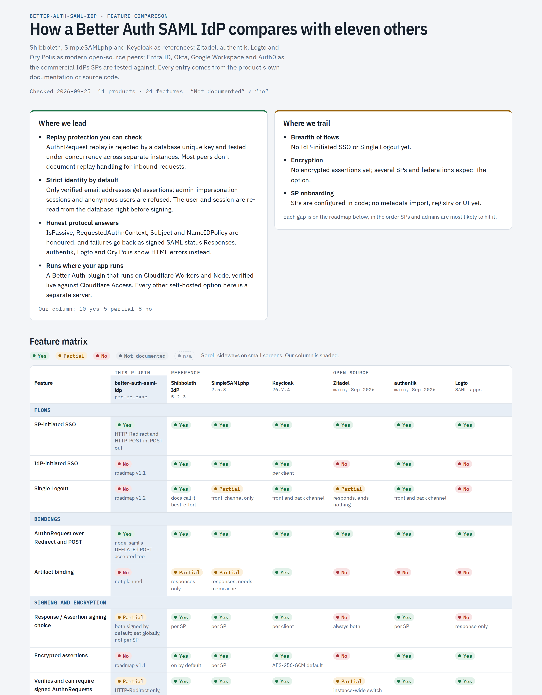

# better-auth-saml-idp

A [Better Auth](https://www.better-auth.com) plugin that turns your Better Auth server into a **SAML 2.0 Identity Provider**. It signs users in to SAML service providers such as HubSpot with SP-initiated SSO. It runs on **Cloudflare Workers** and **Node 20+**, with no Java and no native binaries.

> **Unofficial community plugin.** This project isn't affiliated with or endorsed by Better Auth.

> Status: pre-release. Phases 0–3 are done: runtime, plugin skeleton, SP-initiated SSO, example app and interop. Design decisions and evidence are in `DECISIONS.md`.

> [!WARNING]
> **Cloudflare Workers users: put `samlIdp()` inside `withCloudflare`'s second argument.** If you write `plugins: [...]` next to `...withCloudflare(...)`, your array **replaces** the Cloudflare plugin. That silently disables its storage validation, IP detection and geolocation. You also need `better-auth-cloudflare` **≥ 0.4**.

## Requirements

- `better-auth` `>=1.7.5 <1.8.0`
- A real database adapter (D1/Drizzle, Postgres, MySQL, SQLite…). Replay protection depends on primary-key enforcement.
- `verification.storeInDatabase: true` whenever secondary storage (for example KV) is configured
- On Workers: `better-auth-cloudflare` ≥ 0.4 and the `nodejs_compat` flag

## Cloudflare Workers (D1 + Drizzle)

```ts
import { betterAuth } from "better-auth";
import { withCloudflare } from "better-auth-cloudflare";
import { drizzle } from "drizzle-orm/d1";
import { samlIdp } from "better-auth-saml-idp";

export const createAuth = (env: Env, cf: IncomingRequestCfProperties) =>
  betterAuth({
    ...withCloudflare(
      { d1: { db: drizzle(env.DB, { schema }), options: { usePlural: true } }, cf },
      {
        verification: { storeInDatabase: true },
        rateLimit: { storage: "database" },
        plugins: [
          samlIdp({
            entityId: "https://auth.example.com/api/auth/saml2/idp",
            baseURL: "https://auth.example.com/api/auth", // pin the IdP's own URLs
            loginPage: "/sign-in",
            // What your sign-in guarantees; matched against SPs' RequestedAuthnContext.
            authnContextClassRef: "urn:oasis:names:tc:SAML:2.0:ac:classes:PasswordProtectedTransport",
            signing: { privateKey: env.SAML_IDP_PRIVATE_KEY, certificate: env.SAML_IDP_CERT },
            serviceProviders: [
              {
                id: "hubspot",
                entityId: "<from HubSpot's SSO settings>",
                acsUrls: ["<from HubSpot's SSO settings>"],
                attributes: (user) => ({ email: user.email }),
              },
            ],
          }),
        ],
      },
    ),
  });
```

**Defaults to know about.** Only users with a **verified email** receive assertions, and admin-impersonation sessions and anonymous users are refused (`accountPolicy`). The NameID follows each SP's `nameIdFormat`: the email for `emailAddress`, an opaque per-SP ID for `persistent`, and a one-time ID for `transient`. Requests the IdP can't satisfy (IsPassive without a session, an unsatisfiable RequestedAuthnContext, a Subject mismatch) get a signed SAML error Response.

Add the plugin's table to your Drizzle schema. Field maps use Drizzle **property keys**, not column names:

```ts
export const samlIdpSeenRequests = sqliteTable(
  "saml_idp_seen_requests",
  {
    id: text("id").primaryKey(),
    key: text("key").notNull().unique(), // hash(spId, requestId): the replay check
    spId: text("sp_id").notNull(),
    requestId: text("request_id").notNull(),
    expiresAt: integer("expires_at", { mode: "timestamp_ms" }).notNull(),
  },
  (t) => [
    uniqueIndex("saml_idp_seen_requests_sp_request_uq").on(t.spId, t.requestId),
    index("saml_idp_seen_requests_expires_idx").on(t.expiresAt),
  ],
);
```

Upgrading from a pre-release that lacked the `key` column: the table only holds short-lived replay markers, so drop and recreate it (see `examples/workers-hono/migrations/0002_seen_request_key.sql`). Expired rows are cleaned up as new requests arrive. If an IdP gets little traffic, you can also delete rows with `expires_at < now` on a cron.

## Endpoints

All endpoints are relative to your Better Auth base path, e.g. `/api/auth`.

| Method | Path | |
|---|---|---|
| GET | `/saml2/idp/metadata` | IdP metadata, to give to the SP |
| GET, POST | `/saml2/idp/sso` | Receives AuthnRequests (HTTP-Redirect and HTTP-POST bindings) |
| GET | `/saml2/idp/resume?rid=` | Where the login page returns the user (`callbackURL`) |

The login page gets `?callbackURL=<absolute resume URL>`. After a successful sign-in, send the browser there.

## Tested against

How it compares with eleven other SAML identity providers, feature by feature and with sources: **[interactive comparison](https://mmcintosh.github.io/better-auth-saml-idp/comparison/)** (or [docs/comparison.md](docs/comparison.md)).

[](https://mmcintosh.github.io/better-auth-saml-idp/comparison/)


`@better-auth/sso`, `@node-saml/node-saml` and samlify run in CI. In a **real Chromium over HTTPS** (Playwright, `pnpm e2e`, also in CI), where every party is a separate site so SameSite and CSP behave as in production, three SPs are tested: Keycloak 26.4 and SimpleSAMLphp 2.5 in Docker, and a `node-saml` SP that uses the POST binding and redirects cross-site after its ACS. SAMLtool validates the Response. Guides for Cloudflare Access, AWS IAM Identity Center and HubSpot are included. See [docs/testing-with-sps.md](docs/testing-with-sps.md) and the [Workers example](examples/workers-hono/README.md).

<!-- roadmap:start (generated by scripts/comparison/gen.py) -->
## Roadmap

Derived from a feature comparison with eleven other SAML identity providers ([docs/comparison.md](docs/comparison.md), checked 2026-09-25).

### v1.0: First npm release

Ship what is built, safely.

- **Release engineering.** dist build with type declarations, lint, npm pack review, provenance, changelog, README quickstart from a clean project.
- **better-auth-cloudflare 0.4.** Replace the vendored build once 0.4 is on npm (the README requires it for Workers users).
- **Key rotation guide.** Document the add-next-certificate, switch, retire sequence using additionalCertificates. Every commercial IdP supports rollover.
- **Second adversarial review.** Review the new code paths from the first round: POST re-entry, error Responses, account policy, NameID.

### v1.1: Close the expected-feature gaps

What admins and SPs assume every IdP has.

- **IdP-initiated SSO (opt-in per SP).** Supported by 8 of the 11 products compared (partially by Ory Polis), including all four commercial IdPs. Off by default, as the spec intended.
- **Encrypted assertions.** AES-256-GCM with RSA-OAEP. Shibboleth encrypts by default; Keycloak, authentik, Logto, Entra and Okta offer it per SP.
- **Register SPs from metadata XML.** A helper that turns an SP's metadata into a serviceProviders entry, including certificates and ACS URLs.
- **Per-SP signing choice.** Move signResponse and signAssertion to each SP, as Shibboleth, Keycloak and authentik do.
- **Signed IdP metadata.** Optional, for SPs and federations that verify metadata signatures.

### v1.2: Operations at scale

For hosts with many SPs or changing SPs.

- **Single Logout.** SP-initiated, front-channel first. Entra, Okta, Keycloak and authentik support it; Shibboleth calls it best-effort.
- **Database-backed SP registry and API.** Add and change SPs at runtime without a redeploy (spec stretch goal).
- **SP metadata URL with refresh.** Pick up SP certificate rotation automatically.
- **Signed AuthnRequests over HTTP-POST.** XML-signature verification with XSW defences, pinned to the SP's certificate.

### Later: Considered

Valuable, but needs design first or depends on the host.

- **Step-up authentication.** Map RequestedAuthnContext to the host's Better Auth 2FA state, as Keycloak does with levels of authentication.
- **Declarative attribute mapping.** Spec open question 5; functions already cover it in code.
- **Upstreaming.** Propose integration with @better-auth/sso on better-auth #6254 once v1 is stable.

### Not planned: Out of scope

Deliberately left out.

- **Artifact binding.** None of the four modern open-source IdPs supports it; no target SP needs it.
- **Outbound SCIM.** Provisioning is a separate concern from SSO; a separate plugin if ever.
- **Admin UI.** Better Auth hosts build their own UI on the registry API.
<!-- roadmap:end -->

## Security

See [docs/security.md](docs/security.md) for the threat model, host configuration requirements (don't use KV for sessions; leave `cookieCache` off) and known limitations.

## Development

```sh
pnpm test          # Node (node:sqlite) + workerd (D1/Drizzle, validateSchema on)
pnpm test:wasm     # the libxml2 WASM validator, Node + workerd
pnpm e2e           # Playwright + Chromium: Keycloak, SimpleSAMLphp (Docker) and a node-saml SP vs. the example IdP on workerd
pnpm typecheck
scripts/use-better-auth.sh latest-1.7   # run the suite against another Better Auth version
```

## License

MIT © Mark McIntosh. Third-party components (libxml2 in `wasm/xsd.wasm`, and the OASIS/W3C schemas) are listed in [THIRD_PARTY_NOTICES.md](THIRD_PARTY_NOTICES.md).
